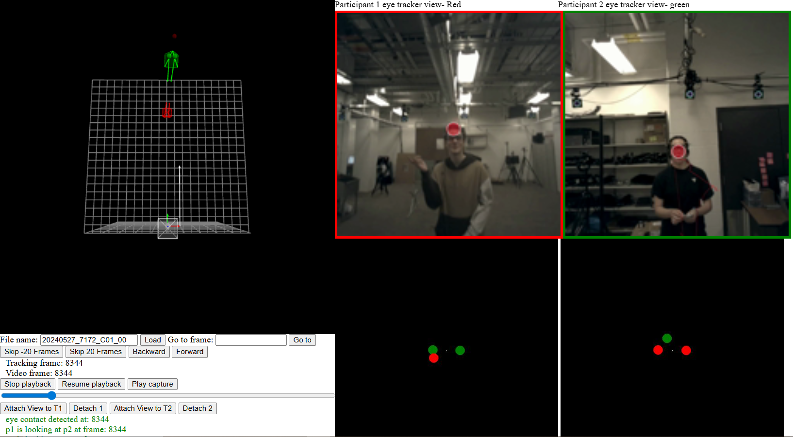
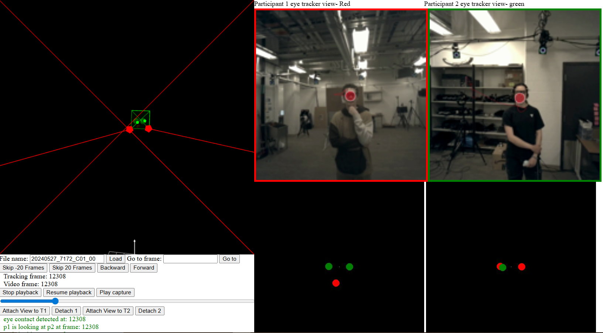
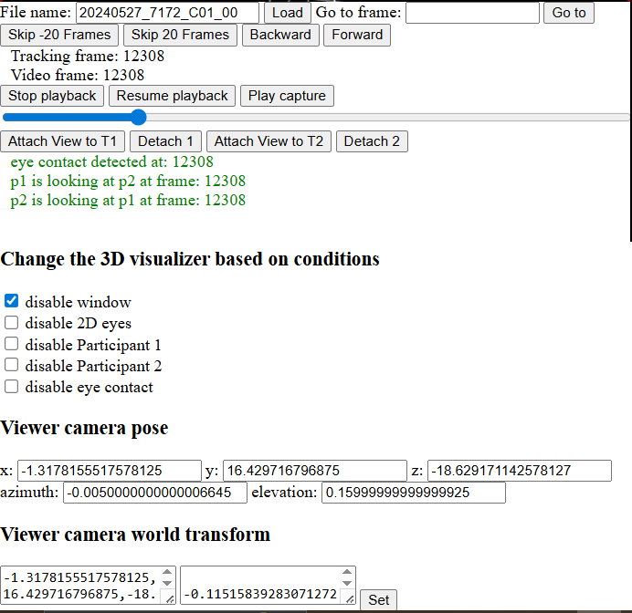

# Eye-Tracker Data Visualization Tool

A comprehensive interactive visualization tool for synchronized motion capture and eye-tracking data analysis, developed during my Master's thesis research.

## 🎯 Why This Visualizer Was Essential

During my Master's research, I collected **over 12+ hours of data from 74 participants** using a synchronized motion capture and eye-tracking setup. This data was crucial for:

- **Developing diffusion-based generative models** for realistic eye movement simulation
- **Designing a four-level evaluation framework** using behavioral gaze principles

### The Core Challenge

One of the major challenges was ensuring that **data from different sources were perfectly synchronized** and transformed into a **unified coordinate system**. This was critical because:

1. **Training Data Quality**: The data would later be used as training data for machine learning models
2. **Research Collaboration**: Our PhD student in psychology needed a comprehensive interactive tool to explore the data and extract meaningful insights
3. **Multi-Modal Integration**: We needed to synchronize:
   - **OptiTrack motion capture** data (head movements in 3D space)
   - **Tobii eye tracker glasses** (gaze data from both participants)
   - **Mounted camera recordings** (first-person video perspectives)

## 🎬 Demo

### Video Demonstration
Watch the full demo video: 

### Screenshots

#### Main Visualization Interface

*The complete visualization showing synchronized 3D motion capture data, eye-tracker feeds, and real-time analysis*

#### Detailed Analysis View

*Detailed view showing eye contact detection and participant interaction analysis*

#### Control Panel

*Interactive control panel with playback controls, camera manipulation, and real-time insights*

##  Key Features

- ** Real-time Synchronization**: Perfectly synchronized motion capture and eye-tracking data
- ** Eye Contact Detection**: Automatic detection and visualization of mutual gaze
- ** Multi-Panel View**: Simultaneous display of 3D spatial data and first-person perspectives
- ** Interactive Controls**: Frame-by-frame navigation, camera manipulation, and data exploration
- ** Behavioral Insights**: Real-time analysis of gaze patterns and social interactions
- ** 3D Visualization**: Immersive 3D environment with participant avatars and gaze vectors

##  Technical Implementation

The visualizer integrates multiple data streams:
- **OptiTrack Motion Capture**: 3D head position and movement tracking
- **Tobii Eye Trackers**: Dual eye-tracking glasses for both participants
- **Synchronized Video**: First-person camera feeds from eye-tracker mounted cameras
- **Unified Coordinate System**: All data transformed and aligned in 3D space

##  Quick Start

### Prerequisites
```bash
# Setup conda environment
conda env create -f environment.yaml
conda activate eye-tracker-viewer
```

### Data Preprocessing
1. Place raw data in the `raw_data` directory
2. Run preprocessing pipeline:
```bash
python preprocess_motive.py <sequence_code>
python convert_json_motive.py <sequence_code>
python eye_contact_viewer.py <sequence_code>
python crop_video.py <sequence_code>
./extract_frames.sh <sequence_code>
```

### Launch Visualization
```bash
python serve.py
```
Open `localhost:8080` in your web browser

## Usage Instructions

1. **Set Camera Position**: Configure `Viewer camera world transform`
2. **Choose Transformation Order**: Select `XYZ` for Motive data
3. **Load Data**: Enter `<sequence_code>` and press `Load`
4. **Start Playback**: Press `Play capture` to begin visualization
5. **Navigate**: Use mouse/touchpad to orbit, arrow keys to walk, Q/E to move up/down

## Research Applications

This tool was specifically designed for:
- **Data Validation**: Ensuring data quality and synchronization accuracy
- **Psychology Research**: Analyzing social interactions and gaze patterns
- **Behavioral Analysis**: Understanding human attention and communication patterns

## Data Collection Scale

- **74 participants** across multiple sessions
- **12+ hours** of synchronized data collection
- **Dual eye-tracker setup** (Tobii glasses for each participant)
- **OptiTrack motion capture** for precise 3D positioning
- **Multi-camera setup** for comprehensive perspective coverage

---

*This visualization tool was developed as part of my Master's thesis research on eye movement simulation and behavioral analysis.*
